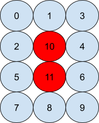

<h1 align="center">QSim</h1>

<b>A quantum programming library in C++ running on a statevector simulator, optimized with data localization, multithreading and vectorization</b>

## Overview

We have created a C++ library for quantum computing that allows the user to simulate any quantum operations that require up to 10 qubits. The library runs on a state-vector simulator, which involves maintaining the state of the circuit at all points in its scope, and updating it whenever an operation is performed. The sample algorithms shown in directory [Sample Codes](./sample-codes/) were used for testing of the library. The application of any gate in a 10-qubit circuit took 64 seconds. We implemented Data Localisation, Multithreading and Vectorisation which brought it down to 1.3 seconds.

## Using the library

The project contains the necessary header files for the library along with some sample programs using it. The “circuit.h” file needs to  be included in a C++ file to include the entire library. The following  features are available to users:
- Declare a circuit with at most 10 qubits (Only allocate as many qubits as required as the runtime grows exponentially with the number of qubits in the circuit).
- Apply any of the following basic 1-qubit gates to any qubit in the circuit: H, X, Y, Z, u3, CNOT.
- Apply the CNOT gate on any two qubits in the circuit.
- Apply the singly controlled version of any single qubit gate with any control and any target qubit in the circuit.
- View the circuit diagram.
- View the circuit diagram of the physical implementation, i.e. the way the circuit would be implemented on a real quantum computer according to the architecture described later.
- Measure any single qubit in the circuit.
- Measure desired qubits in the circuit.
- Measure all qubits in the circuit.

### Compilation instructions:
- Let's say we want to compile a file "EPR.cpp". Run the following command:
    - In Linux:

        `g++ -pthread -O2 -mavx circuit.cpp gate.cpp qubits.cpp matrix.cpp complex.cpp EPR.cpp`
    - In Windows:

        `g++ -O2 -mavx circuit.cpp gate.cpp qubits.cpp matrix.cpp complex.cpp EPR.cpp`
    - In MacOS:
        
        `g++-9 -O2 -mavx circuit.cpp gate.cpp qubits.cpp matrix.cpp complex.cpp EPR.cpp`

## Architecture of the Quantum Computer

The library simulates a 12-qubit quantum computer architecture, with the qubits arranged and indexed as shown in figure. The set of gates, H, X, Y, Z, u3, CNOT is universal for quantum computation, and acts as the instruction set for the quantum computer. Along with this set, we also allow the application of any singly-controlled single-qubit gate. It is assumed that the quantum computer acts as a co-processor to a classical system which instructs it to apply a certain gate to some qubits. Along with these gates, measurements in the standard basis are also possible at any point of time.
    
Qubits 10 & 11 act as ancillary qubits and cannot be allocated by the user. For the application of any multi-qubit gate, the qubits must be close to each other (we assume that 2 qubits are close enough if they are either horizontally, vertically or diagonally adjacent to each other). Thus, qubits 10 and 11 act as intermediaries for the application of any gate to qubits that are not close to each other. This is done by applying multiple SWAP operations. However, the SWAP operations are themselves computationally costly, each requiring 3 CNOT gates. The indexing has thus been chosen in order to minimize the number of SWAP operations for smaller circuits.

Physical Arrangement of Qubits

## License

Licensed under the [MIT License](./LICENSE).
